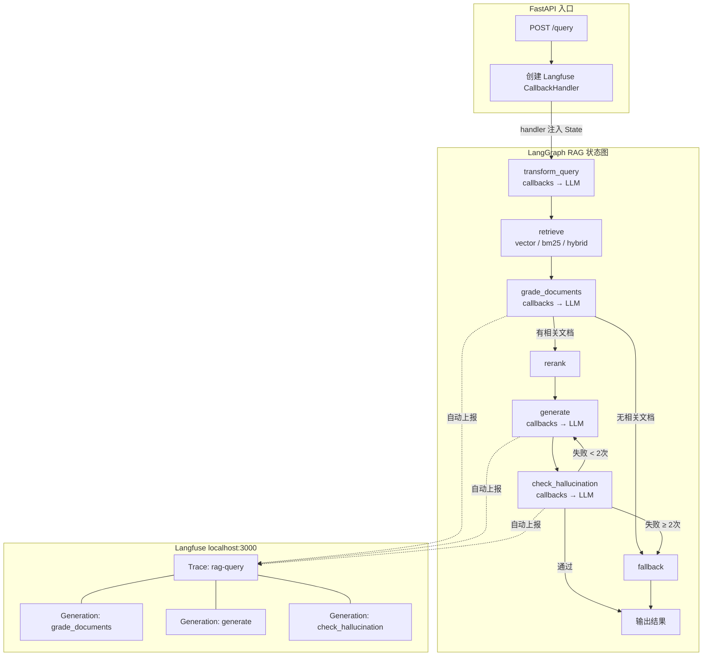

# RAG Demo — LangGraph + Langfuse 全链路可观测

基于 LangGraph 的 RAG（检索增强生成）全链路 Demo。将 RAG 流程建模为状态图，支持文档相关性评估、幻觉检测、条件路由、循环重试和智能入库。集成 Langfuse 实现 LLM 调用全链路追踪。

## 技术栈

| 组件 | 技术选型 |
|------|----------|
| 语言 | Python 3.11+ |
| Web 框架 | FastAPI |
| RAG 框架 | LangGraph + LangChain |
| 向量数据库 | Chroma（嵌入式） |
| Embedding | BAAI/bge-large-zh-v1.5（硅基流动 API） |
| Reranker | BAAI/bge-reranker-v2-m3（硅基流动 API） |
| LLM | DeepSeek / Claude（OpenAI 兼容接口） |
| 关键词检索 | BM25（rank-bm25） |
| 可观测性 | Langfuse v3（自托管 Docker） |

## 架构



> 流式查询（`/query/stream`）使用专用的精简图，跳过幻觉检测环节，避免已输出 token 被重试覆盖。

## 特性

- **状态图编排**：LangGraph 状态图，支持条件分支、循环重试、兜底降级
- **Langfuse 全链路追踪**：每次查询的所有 LLM 调用归到同一条 Trace，可在面板中查看 Input/Output、耗时、Token 消耗
- **文档相关性评估**：LLM 批量判断检索文档是否与问题相关，过滤噪声
- **幻觉检测**：生成回答后验证是否有文档依据，不通过自动重试（最多 2 次）
- **智能入库**：规则分析文档特征，自动选择切分策略，质量验证 + 降级重试
- **多策略切分**：fixed / recursive / semantic 三种策略
- **混合检索**：向量 + BM25，RRF 融合
- **Query 变换**：Query Rewrite / HyDE
- **Reranker**：bge-reranker-v2-m3 二次排序（带自动重试和超时降级）
- **流程可视化**：Mermaid 图自动导出（`/graph`、`/ingest-graph`）
- **执行轨迹**：`graph_steps` 记录每一步执行过程

## 快速开始

### 1. 前置准备

| Key | 用途 | 获取方式 |
|-----|------|----------|
| LLM API Key | 大模型生成回答 | DeepSeek、OpenAI 或其他 OpenAI 兼容接口 |
| 硅基流动 API Key | Embedding + Reranker | [cloud.siliconflow.cn](https://cloud.siliconflow.cn) 免费申请 |

### 2. 环境准备

```bash
git clone https://github.com/daixueyun3377/RAG-demo.git
cd RAG-demo
git checkout dev-Langfuse
pip install -r requirements.txt
```

### 3. 启动 Langfuse

```bash
cd rag-infra
docker compose -f docker-compose-Langfuse.yml up -d
```

等待约 30 秒，访问 http://localhost:3000：
1. 点击 **Sign up** 注册管理员账号
2. 创建项目（如 `RAG-demo`）
3. 进入 **Settings → API Keys**，复制 Public Key 和 Secret Key

### 4. 配置

复制 `.env.example` 为 `.env`，填入 API Key：

```bash
cp .env.example .env
```

```env
# LLM
LLM_API_KEY=your-llm-api-key
LLM_BASE_URL=https://api.deepseek.com
LLM_MODEL=deepseek-chat

# Embedding（硅基流动）
EMBEDDING_API_KEY=your-siliconflow-api-key

# Langfuse（从面板获取）
LANGFUSE_SECRET_KEY=sk-lf-xxx
LANGFUSE_PUBLIC_KEY=pk-lf-xxx
LANGFUSE_HOST=http://localhost:3000
```

### 5. 启动

```bash
uvicorn app.main:app --host 0.0.0.0 --port 8000
```

### 6. 验证

```bash
# 健康检查（确认 Langfuse 显示 enabled）
curl http://localhost:8000/health

# 上传文档
curl -X POST "http://localhost:8000/upload?strategy=recursive&chunk_size=512" \
  -F "file=@docs/sample.md"

# RAG 查询（带 Langfuse 追踪）
curl -X POST http://localhost:8000/query \
  -H "Content-Type: application/json" \
  -d '{
    "question": "什么是RAG？",
    "session_id": "test-001",
    "user_id": "test-user"
  }'
```

查询后打开 Langfuse 面板 → Tracing，即可看到完整的调用链路。

## API 接口

| 方法 | 路径 | 说明 |
|------|------|------|
| POST | `/upload` | 上传文档并入库（手动指定策略） |
| POST | `/smart-upload` | 智能上传（自动选策略 + 质量验证 + 降级重试） |
| POST | `/query` | RAG 查询（Langfuse 全链路追踪，返回 graph_steps） |
| POST | `/query/stream` | 流式 RAG 查询（SSE，逐 token 输出） |
| GET | `/graph` | RAG 查询图 Mermaid 可视化 |
| GET | `/ingest-graph` | 智能入库图 Mermaid 可视化 |
| POST | `/compare-chunks` | 对比不同切分策略效果 |
| POST | `/compare-chunks-detail` | 对比切分策略（含完整 chunk 内容） |
| GET | `/health` | 健康检查（含 Langfuse 状态） |

### /query 参数

| 参数 | 类型 | 默认值 | 说明 |
|------|------|--------|------|
| `question` | string | 必填 | 用户问题 |
| `retrieval_mode` | string | `hybrid` | 检索模式：`vector` / `bm25` / `hybrid` |
| `query_transform` | string | `none` | Query 变换：`none` / `rewrite` / `hyde` |
| `use_reranker` | bool | `false` | 是否启用 Reranker 重排序 |
| `top_k` | int | `5` | 返回 Top-K 结果 |
| `session_id` | string | 可选 | 会话 ID（Langfuse 会话追踪） |
| `user_id` | string | 可选 | 用户标识（Langfuse 用户追踪） |

## 项目结构

```
RAG-demo/
├── app/
│   ├── config.py          # 配置管理（环境变量）
│   ├── llm.py             # LLM / Embedding / Langfuse 初始化
│   ├── retriever.py       # 文档加载、切分、向量存储、检索器、Reranker
│   ├── ingest.py          # 智能入库 LangGraph 状态图
│   ├── rag_graph.py       # RAG 查询 LangGraph 状态图（Langfuse 全链路追踪）
│   └── main.py            # FastAPI 入口
├── docs/
│   ├── sample.md          # 示例文档
│   └── blog-langfuse.md   # Langfuse 集成博客文章
├── rag-infra/
│   ├── docker-compose.yml              # 基础 Docker Compose
│   ├── docker-compose-Milvus.yml       # Milvus 向量数据库部署
│   ├── docker-compose-Langfuse.yml     # Langfuse v3 可观测性平台部署
│   └── README.md
├── tests/
│   ├── test_rag_graph.py  # 单元测试（134 个）
│   ├── test_langfuse.py   # Langfuse 集成测试（27 个）
│   └── test_integration.py # 端到端集成测试
├── .env.example
├── requirements.txt
└── README.md
```

## Langfuse 可观测性

### Langfuse 能看到什么

- **Trace 列表**：每次 RAG 查询对应一条 Trace，显示总耗时和状态
- **调用链路**：展开 Trace 可以看到每个 LLM 节点的 Input/Output、Token 消耗、延迟
- **排查问题**：对比 Input 中的文档和回答，定位幻觉检测误判等问题
- **会话追踪**：通过 session_id 查看同一用户的多轮对话

### Langfuse 基础设施

| 服务 | 作用 | 端口 |
|------|------|------|
| langfuse-web | 前端 + API | 3000 |
| langfuse-worker | 后台任务处理 | 3030 |
| PostgreSQL | 元数据存储 | 5433 |
| ClickHouse | Trace 数据分析 | 8123 |
| MinIO | S3 兼容对象存储 | 9090 |
| Redis | 队列 & 缓存 | 6380 |

### 管理命令

```bash
# 启动
cd rag-infra && docker compose -f docker-compose-Langfuse.yml up -d

# 停止（保留数据）
cd rag-infra && docker compose -f docker-compose-Langfuse.yml down

# 停止并删除数据
cd rag-infra && docker compose -f docker-compose-Langfuse.yml down -v
```

## 测试

```bash
# 全部单元测试（161 个）
python -m pytest tests/test_rag_graph.py tests/test_langfuse.py -v

# 仅 Langfuse 测试（27 个）
python -m pytest tests/test_langfuse.py -v

# 集成测试（需要真实 LLM/Embedding 服务）
python -m pytest tests/test_integration.py -v -s
```

## License

MIT
